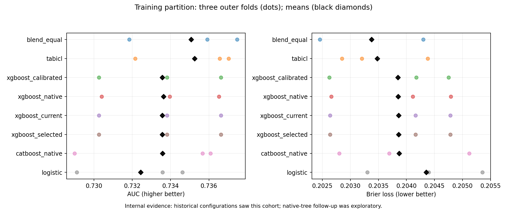

# Independent leakage and accuracy review — 23 September 2026

The new audit found no direct evaluation-label path in the current training pipelines. It does **not** certify that all leakage is absent. Measurement timing, historical evaluation reuse, and upstream model-selection exposure remain unresolved. XGBoost is competitive; its tiny gap to TabICL is smaller than some reproducibility effects measured here.

## What was checked afresh

The [NIJ codebook](https://nij.ojp.gov/funding/recidivism-forecasting-challenge-appendix-2-codebook.pdf) separates prior history and prison-entry information from activities occurring during supervision. The four abbreviated fields `_v1`–`_v4` refer to prior arrest/conviction history, not future recidivism. The first risk score and supervision assignment are described as initial measurements; gang verification has no measurement date. Their availability exactly at supervision start cannot be established from these files alone.

The new audit compares the feature schema against the **independent original first-year test release**, rather than relying only on our own baseline allowlist. All 29 selected feature values also match the original training and first-year test files when aligned by ID. No evaluation ID occurs in training. This rules out an unnoticed update of these baseline fields in the post-challenge full CSV.

New adversarial tests reject injected targets, annual outcomes, IDs, split indicators, protected fields and supervision-activity fields. Changing evaluation outcomes or program attendance leaves the training inputs, training labels and evaluation feature matrix unchanged. Synthetic tests check that numeric imputation and categorical encoding learn only from fitting rows. TabICL's installed encoder is fitted in `fit`; prediction calls receive features without evaluation labels.

There are 15 shared coarse feature patterns covering 20 evaluation rows. Different IDs are not independently verified identities, and equal coarsened fields are not proof of duplicate people. Excluding those 20 rows gives AUC 0.732722 for XGBoost and 0.732894 for TabICL: a gap of just 0.000171. This is a sensitivity check, not a reason to redefine the official partition.

`Gang_Affiliated` missingness marked all 2,217 training women. This is a **protected-attribute proxy channel**, not automatically future-outcome leakage. Training-mode filling removes the explicit missing category; it cannot remove all gender information from the remaining fields. The older claim that this fix proved “no protected-attribute leak” was too broad and has been corrected.

Evidence: [independent checks](../artifacts/deep_review/leakage_audit.json), [boundary tests](../tests/test_leakage_boundaries.py).

## Negative controls and timing sensitivity

On a fixed 80/20 subdivision of training, three separate shuffled-label fits gave XGBoost AUC 0.477–0.489 and TabICL 0.451–0.464. Brier losses were around the constant-prevalence benchmark. These results provide no sign of a direct path to validation labels. **They do not rule out temporal leakage:** a future-derived feature would also lose its relationship when training outcomes are shuffled. Three controls on one split are not a formal permutation significance test.

Removing gang affiliation, initial risk score and initial supervision level together reduces AUC from 0.729898 to 0.721709 for XGBoost and from 0.730280 to 0.720794 for TabICL. Most of the predictive signal survives, and the ordering reverses. The remaining gain cannot establish the timing of the omitted fields.

A separate, deliberately invalid positive control adds post-release supervision activities while excluding explicit targets. On the same split, XGBoost rises from AUC **0.729293 to 0.813257** and Brier falls from **0.205051 to 0.171785**. Those activities are unavailable for a supervision-start decision. The higher score illustrates how timing leakage could create an impressive but invalid result; this model is never saved or selected. Its baseline uses four CPU threads, explaining the small difference from the control above.

Evidence: [negative controls and ablation](../artifacts/deep_review/leakage_stress.csv), [explicitly ineligible positive control](../artifacts/deep_review/INELIGIBLE_timing_positive_control.csv).

## Accuracy experiments

The initial protocol was written before outer evaluation: three outer folds within the 18,028 training records, each with three inner folds selecting among 13 XGBoost configurations by mean Brier loss, with AUC as a tie-breaker. The grid tests ordinal versus one-hot count encoding, depths 1–4, regularization and learning rate/tree-count combinations: **117 inner fits**. The existing parameter configuration won all three outer selections. A training-OOF sigmoid calibrator produced negligible improvement.

An explicitly exploratory follow-up used 27 further inner fits for native categorical XGBoost on CUDA, plus a fixed native CatBoost comparison. Neither materially improved over the existing XGBoost configuration. Conventional nested fits use four threads consistently; the published main model uses all available CPUs. No thread setting was selected by accuracy.

| Candidate | Mean outer AUC | Mean outer Brier ↓ |
|---|---:|---:|
| Existing XGBoost parameters, 4 threads | 0.733567 | 0.203862 |
| Inner-selected XGBoost | 0.733567 | 0.203862 |
| Selected XGBoost + sigmoid calibration | 0.733567 | 0.203850 |
| Native categorical XGBoost | 0.733624 | 0.203854 |
| Native categorical CatBoost | 0.733579 | 0.203871 |
| TabICLv2, 16 members | 0.735250 | 0.203478 |
| Fixed 50/50 XGBoost–TabICL average | 0.735075 | **0.203378** |
| Logistic regression | 0.732432 | 0.204353 |

Inner selection excludes outer labels, but historical configurations and TabICL ensemble size were already informed by this training cohort. These are internal robustness results, not a newly untouched evaluation of the entire historical research process. Three folds share training records; their variation is not a population confidence interval. The fixed grid does not establish a global performance optimum. Sources: [protocol](../artifacts/deep_review/accuracy_protocol.json), [fold results](../artifacts/deep_review/accuracy_outer_folds.csv), [combined table](../artifacts/deep_review/combined_summary.csv).



The fixed equal-weight blend was specified before outer scores were computed. Its subsequent **exploratory** report on the reused official evaluation set gives AUC **0.733221** and Brier **0.204166**, versus XGBoost's 0.732364 and 0.204474. Relative Brier reduction is about 0.15%. Paired 95% intervals for blend minus XGBoost include zero: AUC [-0.000108, 0.001776], Brier [-0.000644, 0.000034]. These condition on fixed predictions and exclude training/selection uncertainty.

The blend does not improve everything: it captures 1,289 observed arrests among 1,561 selected people, versus XGBoost's 1,297, and has higher ECE (0.01553 versus 0.01123). It adds TFM inference and explanation cost. Retain it as an accuracy research challenger rather than silently replacing the required three-family comparison. No ensemble weight was optimized using evaluation labels. See [blend metrics](../artifacts/deep_review/blend_evaluation.csv).

## Reproducibility and reporting defects found

1. **XGBoost thread sensitivity.** On identical records and seed, changing `n_jobs` from 4 to all 22 logical CPUs changes AUC by 0.000604 and some probabilities by up to 0.035133. Repeating each setting reproduces exactly in this environment. This is larger than the published 0.000443 AUC gap between model families. The exact low-level cause was not isolated. Historical tuning used one thread, so matching parameters alone does not guarantee identical fitted trees across runtime settings. Future main-run manifests now record the requested thread setting and logical CPU count; use saved models for exact published predictions. [Measured evidence](../artifacts/deep_review/thread_sensitivity.json).
2. **TabICL query-size sensitivity.** With the same fitted cache, the maximum observed change was 0.000093 for eight rows versus the full batch and 0.000947 for single-row versus eight-row calls. Numerical execution is a plausible cause, not established here. Scores near an allocation cutoff can be sensitive to these differences. The checkpoint was `tabicl-classifier-v2-20260212.ckpt` on CUDA. [Evidence](../artifacts/deep_review/tabicl_inference_checks.json).
3. **Incorrect chart ranking.** The trade-off matrix ranked rounded strings. XGBoost and TabICL both displayed Brier 0.204, so the former received the best color even though its full-precision loss was worse. The chart now ranks full-precision numbers, treats exact ties alike and labels colors as descriptive.
4. **XPER reconstruction mismatch.** Contributions plus benchmark exceed sample AUC by 0.01792 for logistic and 0.02279 for XGBoost. The chart previously asserted exact equality. It now displays the residual, and a diagnostic CSV records it. The precise numerical cause is unresolved; the values are approximate exploratory attributions. [Diagnostics](../artifacts/xper_diagnostics.csv).
5. **Overstated earlier assurances.** Passing a limited audit, having distinct public IDs, and failing a shuffled-label prediction test cannot prove absence of every form of leakage. Documentation now makes those limits explicit.

TabICL's [official implementation](https://github.com/soda-inria/tabicl) describes synthetic pretraining. This supports a different provenance from training on the NIJ outcome table, but does not independently audit upstream benchmark-driven checkpoint selection. Our local inspection cannot certify the complete upstream training/selection history. [Scikit-learn's guidance](https://scikit-learn.org/stable/common_pitfalls.html) supports keeping learned preprocessing and model selection inside their respective fitting partitions; [XGBoost's documentation](https://xgboost.readthedocs.io/en/stable/tutorials/categorical.html) motivated testing native category partitions.

## Reproduce this review

Run from the project root. These experiments write to `artifacts/deep_review/` and preserve the published fitted models and predictions. CUDA is used for TabICL and native XGBoost; the conventional search uses CPU.

```powershell
python scripts/deep_leakage_audit.py --output artifacts/deep_review/leakage_audit.json
python scripts/accuracy_review.py
python scripts/native_accuracy_review.py
python scripts/leakage_stress.py
python scripts/leakage_positive_control.py
python scripts/thread_sensitivity.py
python scripts/summarize_deep_review.py
python -m pytest -q
```

Source and output hashes are recorded in `artifacts/deep_review/source_and_result_hashes.json`; package versions for this environment remain in `artifacts/validation_manifest.json`. The main reproduction pipeline now includes the independent original-release leakage checks. New temporal/external observations remain necessary to establish real improvement and validate measurement timing.
